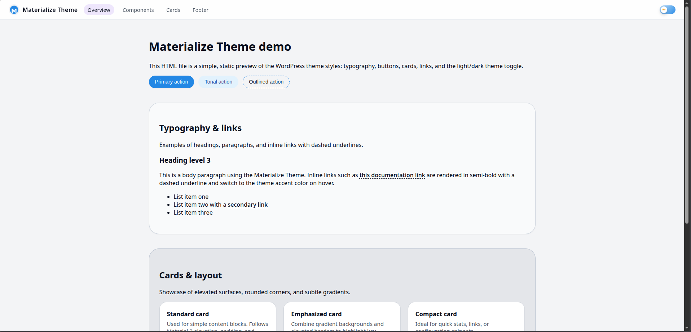
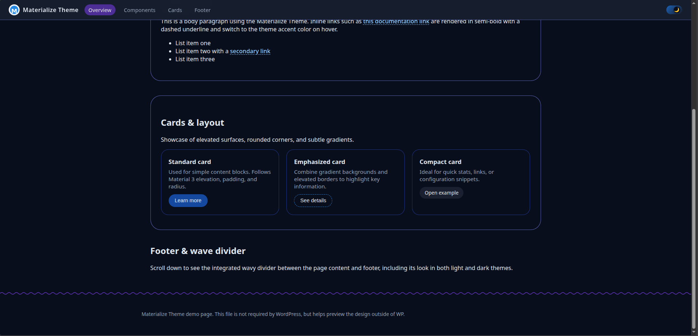

# 🧩 Materialize Theme  
### A Clean, Flat Material Design 3 WordPress Theme


Materialize Theme is a lightweight, modern WordPress theme inspired by **Google’s Material Design 3**, rebuilt with **flat, solid colors**, clean surfaces, and a polished blue accent tone.  
The theme avoids gradients and visual noise, focusing instead on clarity, simplicity, and elegant usability.

---

## ✨ Features

- 🎨 **Flat Material 3 styling** — no gradients, only clean solid colors  
- 💙 **Solid blue accent palette** (Material Blue 600)  
- 🌓 **Light & Dark theme support**  
- 📝 **Typography-first approach** with dashed underlined links  
- 🔘 **Styled buttons** (Primary, Tonal, Outlined-Dashed)  
- 🃏 **Material-style cards and section layouts**  
- 📄 Included WordPress templates:  
  - `front-page.php` — Homepage  
  - `page-downloads.php` — Downloads page  
- 🧪 Includes **demo.html** to preview the theme outside WordPress  
- ⚡ Lightweight, clean, and easy to customize

---

## 📸 Screenshots

### Theme — Light Mode


### Theme — Dark Mode


---

## 🚀 Installation

1. Download the theme ZIP.  
2. Go to **WordPress → Appearance → Themes → Add New → Upload Theme**.  
3. Select the ZIP and install it.  
4. Activate **Materialize Theme**.  
5. (Optional) Open `demo.html` to preview the theme components.

---

## 📁 Project Structure

```
Materialize_Theme/
├── style.css
├── functions.php
├── header.php
├── footer.php
├── front-page.php
├── page-downloads.php
├── demo.html
└── assets/
    ├── css/styles.css
    ├── js/script.js
    └── img/m-logo.png
```

---

## ❓ FAQ

### **1. Does the theme support child themes?**  
Yes. The structure is clean and minimal, making it fully compatible with WordPress child themes.

### **2. Can I change the accent color?**  
Absolutely. Edit `:root { --accent-color: ... }` inside `styles.css` to apply any Material color.

### **3. How do I add custom pages?**  
Just create a new page in WordPress and select one of the included templates, or build your own using the theme’s structure.

### **4. Is it compatible with page builders?**  
Yes, the theme is lightweight and works well with Elementor, Gutenberg, Bricks and most modern builders.

### **5. Does it support WooCommerce?**  
Basic compatibility is provided, but a WooCommerce‑styled pack can be added if requested.

---

## 🤝 Contributing

Pull requests are welcome.  
If you’d like to improve styles, extend Material 3 components, or add customizer options, feel free to contribute.

---

## 📜 License

This project is licensed under the **MIT License**.
